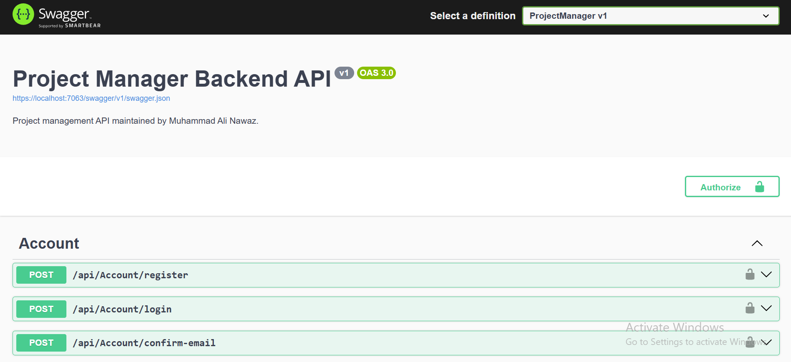
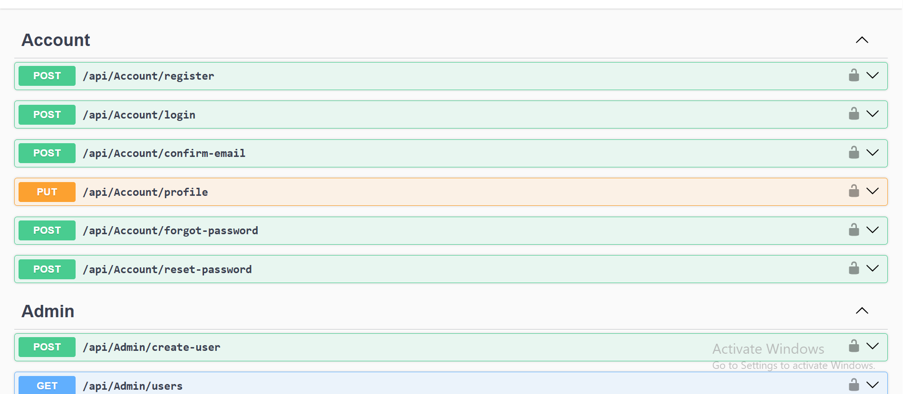
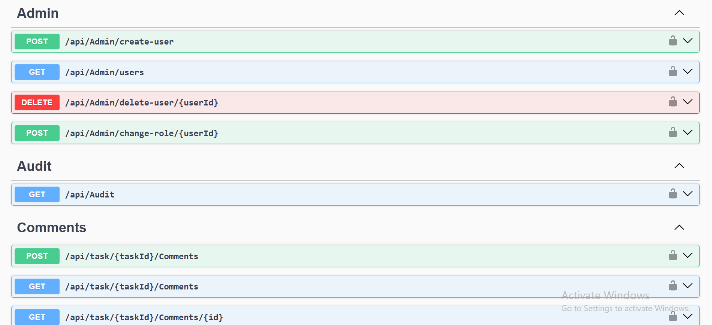
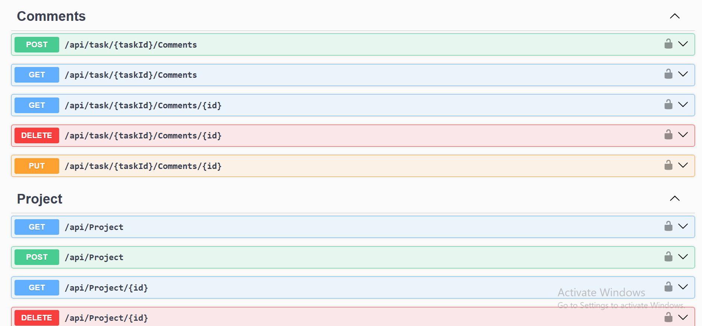
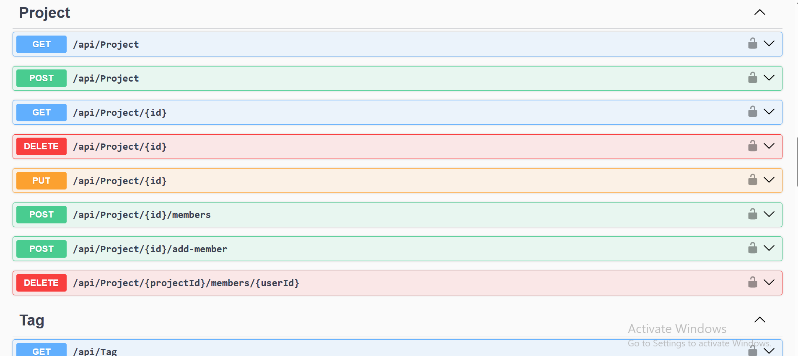
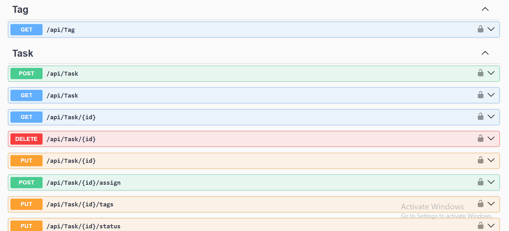

<h1 align="center">📋 Project Management API</h1>

<p align="center">
  <b>A secure, portfolio-ready project and task management backend built with ASP.NET Core 8, ASP.NET Core Identity, JWT authentication, resource-based authorization, Entity Framework Core, Dapper, SQL Server, Serilog, Swagger/OpenAPI, and xUnit.</b>
</p>

<p align="center">
  
  
  
  
  
  
  
  
</p>

---

## 📸 Project Screenshots

| Swagger API Documentation | Account API |
|---|---|
|  |  |

| Audit API | Comment API  |
|---|---|
|  |  |

| Project API | Task API |
|---|---|
|  |  |


---

## 🚀 Project Overview

**Project Management API** is an API-first backend for managing authenticated users, role-based project access, project memberships, tasks, tags, comments, and audit history.

The system supports three application roles:

- **Admin** — manages users and roles, accesses all projects and tasks, and reads audit history.
- **Manager** — creates and manages owned projects, project members, and project tasks.
- **Member** — views joined projects, works with assigned tasks, updates permitted task status, and participates in task comments.

ASP.NET Core Identity manages accounts, passwords, roles, email confirmation, lockouts, password reset tokens, and security stamps. JWT access tokens protect API endpoints and are invalidated when a user's Identity security stamp changes.

Entity Framework Core owns application writes, relationships, Identity storage, and migrations. Dapper is retained for optimized project/task read models backed by version-controlled SQL Server stored procedures and a scalar function.

---

## 🎯 Project Purpose

This project demonstrates practical ASP.NET Core backend engineering with:

- Authentication and role-based access
- Resource-based authorization
- Secure JWT creation and validation
- Identity security-stamp token revocation
- Project and membership management
- Task assignment and status workflows
- Task tags and comments
- EF Core and Dapper working together
- Reproducible SQL Server migrations and database objects
- Audit logging with sensitive-value redaction
- Correlation IDs and safe error handling
- Login rate limiting and Identity lockout controls
- Secret-safe local configuration
- Automated security and authorization tests

---

## ⭐ Key Highlights

- 🔐 JWT access tokens signed with HMAC-SHA512
- 🔑 Minimum 64-byte JWT key validation
- ⏱️ Configurable 5–120 minute access-token lifetime
- 🚫 Zero JWT clock skew
- 🔄 Security-stamp validation on authenticated requests
- 👥 Admin, Manager, and Member roles
- 🛡️ Custom resource-based authorization handlers for projects, tasks, and comments
- 📁 Manager ownership checks for project administration
- ✅ Member access restricted to joined projects and assigned tasks
- 🧑‍💼 Admin-only user creation, deletion, and role changes
- 🔒 Admin self-deletion and self-role-change safeguards
- 📌 Task assignees must already belong to the parent project
- 🏷️ Tag-ID existence validation and duplicate removal
- 💬 Task-scoped comment authorization
- 🧾 Global mutation auditing with sensitive-field sanitization
- 🔗 Validated `X-Correlation-ID` request and response support
- ⚠️ Safe Problem Details responses for unexpected failures
- 🚦 IP-partitioned login rate limiting
- 🔐 Identity account lockout after repeated failed logins
- 🗃️ EF Core migrations install Dapper SQL objects
- 🧪 42 passing xUnit test executions
- 📘 Swagger/OpenAPI Bearer authentication support
- 🔒 Database and JWT secrets stored outside Git

---

## ✨ Features

### 🔐 Authentication and Account Security

| Feature | Description |
|---|---|
| Registration | Creates a Member account and sends an email-confirmation link |
| Email Confirmation | Confirms URL-safe Identity confirmation tokens |
| Login | Returns user details, role, and a signed JWT |
| Login Rate Limiting | Limits login requests per remote IP |
| Identity Lockout | Applies failed-access counting and temporary lockout |
| JWT Validation | Validates signing key, issuer, audience, expiry, and required expiration |
| Zero Clock Skew | Rejects expired tokens without an additional grace period |
| Security-Stamp Validation | Rejects tokens after password, role, or account-security changes |
| Profile Update | Updates name, phone, and optionally password |
| Forgot Password | Sends a generic password-reset response to avoid account discovery |
| Password Reset | Resets passwords using URL-safe Identity tokens |

### 👥 User and Role Administration

| Feature | Description |
|---|---|
| Admin User Creation | Creates confirmed users with an existing application role |
| User Listing | Admin sees other users; Manager receives Member accounts |
| User Deletion | Admin deletes another user but cannot delete their own account |
| Role Change | Admin changes another user's role transactionally |
| Token Invalidation | Role changes update the Identity security stamp |
| Seeded Administrator | Optional first-run local administrator through User Secrets |

### 📁 Project Management

| Feature | Description |
|---|---|
| Project Listing | Admin sees all projects; other roles receive authorized projects |
| Project Creation | Admin and Manager create projects |
| Project Details | Returns creator and project-member details |
| Project Update | Admin or owning Manager updates project information |
| Project Deletion | Blocks deletion while unfinished tasks remain |
| Membership Management | Authorized project managers add and remove members |
| Creator Protection | Prevents removal of the project creator |
| Active-Task Protection | Prevents removal of members assigned to active tasks |

### ✅ Task Management

| Feature | Description |
|---|---|
| Task Creation | Admin or owning Manager creates a project task |
| Dashboard Tasks | Returns role-filtered Dapper task read models |
| Project Tasks | Filters tasks by project and current-user access |
| Task Details | Returns project, assignee, and tag information |
| Assignment | Reassigns a task only to a member of its project |
| Task Update | Authorized Admin or owning Manager updates task details |
| Status Update | Assigned Member can update permitted task status |
| Tag Update | Authorized task manager replaces validated task tags |
| Task Deletion | Blocks deletion of tasks currently in progress |
| Overdue Count | Manager receives overdue-task count through a SQL function |

### 🏷️ Tags

| Feature | Description |
|---|---|
| Tag Listing | Authenticated users retrieve available tag IDs and names |
| Tag Validation | Rejects missing, invalid, or non-positive tag IDs |
| Task Tag Mapping | Uses a many-to-many `TaskTag` relationship |

### 💬 Task Comments

| Feature | Description |
|---|---|
| Add Comment | Authorized task participants add comments |
| List Comments | Returns comments for an accessible task |
| Get Comment | Returns one task-scoped comment |
| Edit Comment | Comment author or Admin edits a comment |
| Delete Comment | Comment author or Admin deletes a comment |
| Parent Authorization | Every comment operation first validates access to the task |

### 🧾 Audit and Diagnostics

| Area | Implementation |
|---|---|
| Audit Filter | A global action filter records successful mutation activity |
| Audit Storage | Activity records include entity, action, user, timestamp, and snapshots |
| Sensitive Redaction | Password, token, authorization, credential, and secret-like values are redacted |
| Correlation Header | Accepts and returns `X-Correlation-ID` |
| Correlation Validation | Rejects unsafe or oversized client values and generates a safe replacement |
| Structured Logging | Serilog writes console output and rolling files |
| Safe Errors | Middleware returns Problem Details without exposing stack traces |

---

## 🛠 Technology Stack

| Layer | Technologies |
|---|---|
| Runtime | .NET 8, SDK pinned to 8.0.423 |
| Backend | ASP.NET Core 8 Web API, C# |
| Authentication | ASP.NET Core Identity, JWT Bearer |
| JWT Library | System.IdentityModel.Tokens.Jwt 8.19.2 |
| Authorization | Roles, policies, and custom resource authorization handlers |
| ORM | Entity Framework Core 8.0.29 |
| Read Data Access | Dapper 2.1.66 |
| Database | Microsoft SQL Server |
| SQL Objects | Stored procedures and scalar function |
| API Documentation | Swagger / OpenAPI through Swashbuckle 6.6.2 |
| Logging | Serilog.AspNetCore 8.0.0, console and rolling file sinks |
| Serialization | System.Text.Json with camelCase and string enums |
| Testing | xUnit 2.9.2, Moq 4.20.72, EF Core InMemory |
| Test Platform | Microsoft.NET.Test.Sdk 17.11.1 |
| Coverage | coverlet.collector 6.0.2 |
| EF CLI | Repository-local `dotnet-ef` 8.0.29 |

---

## 🏗 Architecture Overview

The application preserves a pragmatic controller/service/repository architecture.

```text
HTTP Client / Swagger / Frontend
              ↓
ASP.NET Core Controllers
              ↓
Role and Resource Authorization
              ↓
Application Services / EF Core / Dapper Repositories
              ↓
Mapping and Audit Services
              ↓
SQL Server
```

### Write Flow

```text
Authenticated request
        ↓
Controller and DTO validation
        ↓
Role/resource authorization
        ↓
Entity Framework Core write
        ↓
SQL Server transaction
        ↓
Audit action filter
        ↓
HTTP response with correlation ID
```

### Read Flow

```text
Authenticated request
        ↓
Role-aware user filter
        ↓
Dapper repository
        ↓
Stored procedure / scalar function
        ↓
Flat result mapping service
        ↓
Response DTO
```

### Authentication Flow

```text
Login request
        ↓
IP rate limiter
        ↓
Identity account and email-confirmation checks
        ↓
Password verification and lockout accounting
        ↓
JWT creation with user, role, claim, and security-stamp data
        ↓
Client sends Authorization: Bearer TOKEN
        ↓
JWT validation and security-stamp verification
```

### Layer Responsibilities

| Layer | Responsibility |
|---|---|
| `Controllers` | HTTP routing, request handling, role checks, resource authorization |
| `Auth/Handlers` | Project, task, and comment permission decisions |
| `Configuration` | Strict JWT loading and validation parameters |
| `Data` | EF Core context and relationship configuration |
| `Repositories` | Dapper and EF-backed project/task operations |
| `Services` | Tokens, security-stamp checks, email, seeding, auditing, mapping |
| `Filters` | Global action auditing |
| `Middleware` | Correlation IDs and exception-to-Problem-Details handling |
| `Migrations` | Versioned SQL Server schema and Dapper object installation |
| `Database/Scripts` | Idempotent Dapper object installation and verification |
| `ProjectManager.Tests` | Security, authorization, validation, JWT, controller, and database-contract tests |

---

## 🔐 Role and Permission Matrix

| Capability | Admin | Manager | Member |
|---|---:|---:|---:|
| Create users and assign roles | Yes | No | No |
| Change or delete users | Yes | No | No |
| List users | Other users | Members | No |
| Read audit history | Yes | No | No |
| Create projects | Yes | Yes | No |
| View projects | All | Owned/authorized | Joined |
| Update projects | All | Owned | No |
| Delete projects | All | Owned | No |
| Manage project members | All | Owned | No |
| Create tasks | All | Owned projects | No |
| View tasks | All | Owned/authorized | Assigned |
| Update task details | All | Owned projects | No |
| Assign tasks | All | Owned projects | No |
| Update task status | All | Owned projects | Assigned tasks |
| Delete tasks | All | Owned projects | No |
| Read/add task comments | Accessible tasks | Accessible tasks | Assigned tasks |
| Edit/delete comments | All | Own comments | Own comments |

---

## 📁 Repository Structure

```text
aspnet-project-management-api/
├── docs/
│   └── screenshots/
│       ├── account_api.png
│       ├── audit_api.png
│       ├── comment_api.png
│       ├── project_api.png
│       ├── swagger.png
│       └── task_api.png
├── project-manager-backend-api/
│   ├── .config/
│   │   └── dotnet-tools.json
│   ├── ProjectManager/
│   │   ├── Auth/
│   │   │   ├── Handlers/
│   │   │   └── Requirements/
│   │   ├── Configuration/
│   │   ├── Controllers/
│   │   ├── Data/
│   │   ├── Database/
│   │   │   └── Scripts/
│   │   ├── DTOs/
│   │   ├── Filters/
│   │   ├── Interfaces/
│   │   ├── Middleware/
│   │   ├── Migrations/
│   │   ├── Models/
│   │   ├── Repositories/
│   │   ├── Services/
│   │   ├── Properties/
│   │   ├── appsettings.json
│   │   ├── appsettings.Development.example.json
│   │   ├── Program.cs
│   │   └── ProjectManager.csproj
│   ├── ProjectManager.Tests/
│   │   ├── GlobalUsings.cs
│   │   ├── AccountControllerTests.cs
│   │   ├── AuditAndCorrelationTests.cs
│   │   ├── AuthorizationHandlersTests.cs
│   │   ├── ControllerAuthorizationTests.cs
│   │   ├── DatabaseObjectTests.cs
│   │   ├── JwtTests.cs
│   │   ├── TaskAndCommentSecurityTests.cs
│   │   ├── TaskAuthorizationRegressionTests.cs
│   │   ├── ValidationTests.cs
│   │   └── ProjectManager.Tests.csproj
│   ├── global.json
│   └── ProjectManager.sln
├── .gitignore
├── LICENSE
└── README.md
```

> Generated `bin`, `obj`, `Logs`, `publish`, test-result, coverage, secret, local configuration, backup, and user-specific IDE files must remain untracked.

---

## 🗃 Database Model

### Application Tables

| Table/Entity | Purpose |
|---|---|
| ASP.NET Identity tables | Users, roles, claims, logins, tokens, and user-role relationships |
| `Projects` | Project metadata, creator, dates, and status |
| `ProjectUsers` | Many-to-many membership between projects and users |
| `Tasks` | Project tasks, assignee, creator, priority, due date, and status |
| `Tags` | Available task labels |
| `TaskTags` | Many-to-many relationship between tasks and tags |
| `Comments` | Task comments and authors |
| `ActivityLogs` | Audited mutation history |
| `__EFMigrationsHistory` | Applied EF Core migration history |

### Relationships

```text
ApplicationUser 1 ──────── * Projects (CreatorId)
ApplicationUser * ──────── * Projects (ProjectUsers)
Project         1 ──────── * Tasks
ApplicationUser 1 ──────── * Tasks (AssignedUserId)
Task            * ──────── * Tags (TaskTags)
Task            1 ──────── * Comments
ApplicationUser 1 ──────── * Comments (AuthorId)
```

### Dapper Database Objects

| Object | Type | Purpose |
|---|---|---|
| `dbo.spGetProjects` | Stored procedure | Role-filtered project read models |
| `dbo.spGetDashboardTasks` | Stored procedure | Dashboard task read models |
| `dbo.spGetProjectTasks` | Stored procedure | Project-specific task read models |
| `dbo.fnOverdueTasksCount` | Scalar function | Manager overdue-task count |

These objects are installed by migration:

```text
20260716000100_AddDapperDatabaseObjects
```

The same definitions are version-controlled in:

```text
ProjectManager\Database\Scripts\001_DapperObjects.sql
```

Database verification is provided by:

```text
ProjectManager\Database\Scripts\002_VerifyDatabaseObjects.sql
```

### Included Migrations

```text
20251203162421_InitialSetup
20251204161504_AddedNewColumn
20251205133114_NewTablesAndNavigation
20251205171441_NewColumnOnTasksTable
20251208134948_NewCommentsTable
20251216141434_NewActicityLogTable
20251217160640_ChangedDateTimeToDateTimeOffset
20251217163259_UpdatedActivityLog
20260716000100_AddDapperDatabaseObjects
```

---

## 🔄 Application Flows

### Project Creation

```text
Admin or Manager submits project data
              ↓
DTO validation
              ↓
Identity user resolved from JWT
              ↓
Project entity created
              ↓
Creator is added as the first project member
              ↓
EF Core stores project and membership
              ↓
201 Created response returns the project ID
```

### Task Creation and Assignment

```text
Admin or owning Manager submits task
              ↓
Parent project is loaded
              ↓
Resource authorization checks project ownership
              ↓
Assigned user must be a project member
              ↓
All tag IDs must exist
              ↓
Task and task-tag relationships are stored
              ↓
201 Created response returns the task ID
```

### Member Status Update

```text
Member submits new task status
              ↓
Task and parent project are loaded
              ↓
CanUpdateTaskStatus policy is evaluated
              ↓
Member must be assigned to the task
              ↓
Repository updates status
              ↓
204 No Content
```

### Comment Authorization

```text
Authenticated user targets a task comment
              ↓
Parent task is loaded
              ↓
CanViewTask policy validates task access
              ↓
Comment is loaded within the task route
              ↓
Edit/Delete policy validates author or Admin
              ↓
Change is stored and audited
```

---

## 🔌 API Endpoints

Base development URLs:

```text
HTTPS API: https://localhost:7063
HTTP API:  http://localhost:5117
Swagger:   https://localhost:7063/swagger
```

### Account

| Method | Endpoint | Authentication | Purpose |
|---|---|---|---|
| `POST` | `/api/Account/register` | Public | Register a Member account |
| `POST` | `/api/Account/login` | Public, rate limited | Log in and receive a JWT |
| `POST` | `/api/Account/confirm-email` | Public | Confirm an email address |
| `PUT` | `/api/Account/profile` | Bearer token | Update profile and optionally password |
| `POST` | `/api/Account/forgot-password` | Public | Request a reset link |
| `POST` | `/api/Account/reset-password` | Public | Reset a password |

### Administration

| Method | Endpoint | Authentication | Purpose |
|---|---|---|---|
| `POST` | `/api/Admin/create-user` | Admin | Create a confirmed role-assigned user |
| `GET` | `/api/Admin/users` | Admin or Manager | List permitted users |
| `DELETE` | `/api/Admin/delete-user/{userId}` | Admin | Delete another user |
| `POST` | `/api/Admin/change-role/{userId}` | Admin | Change another user's role |

### Audit

| Method | Endpoint | Authentication | Purpose |
|---|---|---|---|
| `GET` | `/api/Audit?page=1&pageSize=20` | Admin | Return paginated activity logs |

### Projects

| Method | Endpoint | Authentication | Purpose |
|---|---|---|---|
| `GET` | `/api/Project` | Bearer token | Return role-filtered projects |
| `POST` | `/api/Project` | Admin or Manager | Create a project |
| `GET` | `/api/Project/{id}` | Authorized project user | Return project details |
| `PUT` | `/api/Project/{id}` | Admin or owning Manager | Update a project |
| `DELETE` | `/api/Project/{id}` | Admin or owning Manager | Delete a completed project |
| `POST` | `/api/Project/{id}/members` | Admin or owning Manager | Assign a project member |
| `POST` | `/api/Project/{id}/add-member` | Admin or owning Manager | Add a project member |
| `DELETE` | `/api/Project/{projectId}/members/{userId}` | Admin or owning Manager | Remove an eligible member |

### Tasks

| Method | Endpoint | Authentication | Purpose |
|---|---|---|---|
| `POST` | `/api/Task` | Admin or owning Manager | Create and assign a task |
| `GET` | `/api/Task` | Bearer token | Return dashboard tasks |
| `GET` | `/api/Task?projectId={id}` | Bearer token | Return tasks for a project |
| `GET` | `/api/Task/{id}` | Authorized task user | Return task details |
| `POST` | `/api/Task/{id}/assign` | Authorized Admin/Manager | Reassign a task |
| `PUT` | `/api/Task/{id}` | Authorized Admin/Manager | Update task details |
| `PUT` | `/api/Task/{id}/tags` | Authorized Admin/Manager | Replace task tags |
| `PUT` | `/api/Task/{id}/status` | Authorized task user | Update task status |
| `DELETE` | `/api/Task/{id}` | Authorized Admin/Manager | Delete an eligible task |
| `GET` | `/api/Task/overdue-tasks` | Manager | Return overdue-task count |

### Comments

| Method | Endpoint | Authentication | Purpose |
|---|---|---|---|
| `POST` | `/api/task/{taskId}/Comments` | Authorized task user | Add a comment |
| `GET` | `/api/task/{taskId}/Comments` | Authorized task user | List task comments |
| `GET` | `/api/task/{taskId}/Comments/{id}` | Authorized task user | Return one comment |
| `PUT` | `/api/task/{taskId}/Comments/{id}` | Author or Admin | Edit a comment |
| `DELETE` | `/api/task/{taskId}/Comments/{id}` | Author or Admin | Delete a comment |

### Tags

| Method | Endpoint | Authentication | Purpose |
|---|---|---|---|
| `GET` | `/api/Tag` | Bearer token | Return available tags |

### Common HTTP Responses

| Status | Meaning |
|---|---|
| `200 OK` | Request completed successfully |
| `201 Created` | Project, task, or comment was created |
| `204 No Content` | Update, assignment, removal, or deletion completed |
| `400 Bad Request` | Validation or business rule failed |
| `401 Unauthorized` | Authentication is missing or invalid |
| `403 Forbidden` | Authenticated user lacks permission |
| `404 Not Found` | Requested resource does not exist |
| `429 Too Many Requests` | Login rate limit was exceeded |
| `500 Internal Server Error` | A safe unexpected-error response was returned |

---

## 🔐 Security and Reliability

| Area | Implementation |
|---|---|
| Password Storage | ASP.NET Core Identity password hashing |
| JWT Signing | HMAC-SHA512 with a secret of at least 64 bytes |
| JWT Validation | Signature, issuer, audience, expiry, and required expiration |
| Token Revocation | Identity security-stamp validation |
| Clock Skew | Zero |
| Access Token Lifetime | Configurable from 5 to 120 minutes |
| Role Authorization | Admin, Manager, and Member |
| Resource Authorization | Project, task, and comment handlers |
| Login Protection | Fixed-window IP rate limiter and Identity lockout |
| Email Tokens | URL-safe Base64 encoding |
| CORS | Configured origins only |
| SQL Reliability | SQL Server retry-on-failure |
| Audit Privacy | Secret-like property names are redacted |
| Error Privacy | Internal exception details remain server-side |
| Correlation IDs | Validated and returned in response headers |
| Secret Storage | .NET User Secrets locally; environment variables in hosted environments |
| Database Reproducibility | EF migrations plus version-controlled SQL scripts |
| Automated Tests | 42 passing executions across security and business rules |

> This is a portfolio-grade single-instance backend. Production deployment still requires centralized secret management, HTTPS termination, rate-limit review, monitoring, backups, dependency review, operational logging, SMTP/provider configuration, and a deployment-specific security assessment.

---

## ⚙️ Installation Guide — Windows PowerShell

### Requirements

- Windows 10 or Windows 11
- PowerShell 5.1 or PowerShell 7+
- .NET SDK 8.0.423 or a compatible .NET 8 SDK
- Microsoft SQL Server Developer Edition, Express, default instance, or LocalDB
- Git
- Optional: `sqlcmd` for database verification
- Optional: an SMTP account for registration confirmation and password-reset emails

Verify tools:

```powershell
dotnet --version
dotnet --list-sdks
git --version
Get-Command sqlcmd -ErrorAction SilentlyContinue
```

The repository's `global.json` selects SDK `8.0.423`.

### 1️⃣ Clone and Open the Repository

```powershell
git clone https://github.com/YOUR_GITHUB_USERNAME/aspnet-project-management-api.git
Set-Location '.\aspnet-project-management-api'

$RepoRoot = (Get-Location).Path
$SolutionRoot = Join-Path $RepoRoot 'project-manager-backend-api'
$SolutionFile = Join-Path $SolutionRoot 'ProjectManager.sln'
$ProjectFile = Join-Path $SolutionRoot 'ProjectManager\ProjectManager.csproj'
$TestProject = Join-Path $SolutionRoot 'ProjectManager.Tests\ProjectManager.Tests.csproj'
```

### 2️⃣ Verify SQL Server

Default SQL Server instance:

```powershell
$SqlServer = $env:COMPUTERNAME
Get-Service -Name 'MSSQLSERVER'
```

SQL Server Express:

```powershell
$SqlServer = "$env:COMPUTERNAME\SQLEXPRESS"
```

LocalDB:

```powershell
$SqlServer = '(localdb)\MSSQLLocalDB'
sqllocaldb start MSSQLLocalDB
```

Create the local connection string:

```powershell
$DatabaseName = 'ProjectManagerDb'
$ConnectionString = "Server=$SqlServer;Database=$DatabaseName;Trusted_Connection=True;MultipleActiveResultSets=True;TrustServerCertificate=True"
```

### 3️⃣ Restore Tools and Packages

```powershell
Set-Location -LiteralPath $SolutionRoot

dotnet restore $SolutionFile
dotnet tool restore
dotnet ef --version
```

Expected EF CLI version:

```text
8.0.29
```

### 4️⃣ Configure Local User Secrets

Set the development environment:

```powershell
$env:ASPNETCORE_ENVIRONMENT = 'Development'
$env:DOTNET_ENVIRONMENT = 'Development'
```

Generate a cryptographically random 64-byte JWT key in PowerShell 5.1 or newer:

```powershell
$JwtBytes = New-Object byte[] 64
$Generator = [System.Security.Cryptography.RandomNumberGenerator]::Create()

try {
    $Generator.GetBytes($JwtBytes)
    $JwtKey = [Convert]::ToBase64String($JwtBytes)
}
finally {
    $Generator.Dispose()
}
```

Store database and JWT settings:

```powershell
dotnet user-secrets set `
    'ConnectionStrings:DefaultConnection' `
    $ConnectionString `
    --project $ProjectFile

dotnet user-secrets set 'Jwt:Key' $JwtKey --project $ProjectFile
dotnet user-secrets set 'Jwt:Issuer' 'ProjectManager.Api' --project $ProjectFile
dotnet user-secrets set 'Jwt:Audience' 'ProjectManager.Client' --project $ProjectFile
dotnet user-secrets set 'Jwt:AccessTokenMinutes' '30' --project $ProjectFile

Remove-Variable JwtKey, JwtBytes, Generator -ErrorAction SilentlyContinue
```

Configure the expected frontend URL:

```powershell
dotnet user-secrets set 'Client:Url' 'http://localhost:4200' --project $ProjectFile
dotnet user-secrets set 'Cors:AllowedOrigins:0' 'http://localhost:4200' --project $ProjectFile
dotnet user-secrets set 'IdentityToken:LifetimeHours' '2' --project $ProjectFile
```

Optional SMTP configuration:

```powershell
dotnet user-secrets set 'EmailSettings:SmtpServer' 'smtp.example.com' --project $ProjectFile
dotnet user-secrets set 'EmailSettings:Port' '587' --project $ProjectFile
dotnet user-secrets set 'EmailSettings:EnableSsl' 'true' --project $ProjectFile
dotnet user-secrets set 'EmailSettings:SenderEmail' 'no-reply@example.com' --project $ProjectFile
dotnet user-secrets set 'EmailSettings:AppPassword' '<SMTP_APP_PASSWORD>' --project $ProjectFile
```

Optional first local administrator:

```powershell
dotnet user-secrets set 'SeedAdmin:Enabled' 'true' --project $ProjectFile
dotnet user-secrets set 'SeedAdmin:Email' 'admin@example.com' --project $ProjectFile
dotnet user-secrets set 'SeedAdmin:Password' '<SET_A_STRONG_LOCAL_PASSWORD>' --project $ProjectFile
dotnet user-secrets set 'SeedAdmin:PhoneNumber' '+10000000000' --project $ProjectFile
```

Review only configured key names:

```powershell
dotnet user-secrets list --project $ProjectFile |
    ForEach-Object { ($_ -split '\s*=\s*', 2)[0] }
```

Never commit or publish JWT keys, connection strings, SMTP passwords, seeded passwords, login tokens, or User Secrets output.

### 5️⃣ Apply Entity Framework Core Migrations

```powershell
Set-Location -LiteralPath $SolutionRoot

dotnet ef database update `
    --project $ProjectFile `
    --startup-project $ProjectFile
```

List migrations:

```powershell
dotnet ef migrations list `
    --project $ProjectFile `
    --startup-project $ProjectFile
```

> Do not create a new initial migration. The repository already contains the complete migration history.

### 6️⃣ Verify SQL Server Objects

When `sqlcmd` is available:

```powershell
sqlcmd `
    -S $SqlServer `
    -d $DatabaseName `
    -E `
    -b `
    -i (Join-Path $SolutionRoot 'ProjectManager\Database\Scripts\002_VerifyDatabaseObjects.sql')
```

Expected database objects:

```text
dbo.spGetProjects
dbo.spGetDashboardTasks
dbo.spGetProjectTasks
dbo.fnOverdueTasksCount
```

### 7️⃣ Build the Solution

```powershell
Set-Location -LiteralPath $SolutionRoot

dotnet clean $SolutionFile --configuration Release
dotnet build $SolutionFile --configuration Release
```

Verified result:

```text
Build succeeded.
0 Warning(s)
0 Error(s)
```

### 8️⃣ Run the Automated Tests

```powershell
dotnet test `
    $TestProject `
    --configuration Release `
    --no-build
```

Verified result:

```text
Failed: 0
Passed: 42
Skipped: 0
Total: 42
```

### 9️⃣ Trust the HTTPS Certificate

```powershell
dotnet dev-certs https --trust
```

### 🔟 Run the Backend API

```powershell
Set-Location -LiteralPath $SolutionRoot

dotnet run `
    --project $ProjectFile `
    --launch-profile https
```

Local URLs:

```text
HTTPS API: https://localhost:7063
HTTP API:  http://localhost:5117
Swagger:   https://localhost:7063/swagger
```

Keep the PowerShell window open while the API runs. Stop it with `Ctrl+C`.

Open Swagger from another PowerShell window:

```powershell
Start-Process 'https://localhost:7063/swagger'
```

Verify availability:

```powershell
Invoke-WebRequest `
    -Uri 'https://localhost:7063/swagger/index.html' `
    -UseBasicParsing |
    Select-Object StatusCode
```

Expected:

```text
StatusCode
----------
200
```

### 1️⃣1️⃣ Disable Repeated Admin Seeding

After the administrator has been created successfully:

```powershell
dotnet user-secrets set 'SeedAdmin:Enabled' 'false' --project $ProjectFile
```

Disabling seeding does not remove the existing account.

---

## ▶️ Normal Daily Startup

After initial setup and migrations:

```powershell
$RepoRoot = 'C:\path\to\aspnet-project-management-api'
$SolutionRoot = Join-Path $RepoRoot 'project-manager-backend-api'
$ProjectFile = Join-Path $SolutionRoot 'ProjectManager\ProjectManager.csproj'

Set-Location -LiteralPath $SolutionRoot

$env:ASPNETCORE_ENVIRONMENT = 'Development'
$env:DOTNET_ENVIRONMENT = 'Development'

dotnet run `
    --project $ProjectFile `
    --launch-profile https
```

Open Swagger:

```powershell
Start-Process 'https://localhost:7063/swagger'
```

---

## 🧪 Testing

Run the complete test suite:

```powershell
Set-Location -LiteralPath $SolutionRoot

dotnet test `
    $SolutionFile `
    --configuration Release
```

Collect coverage:

```powershell
dotnet test `
    $SolutionFile `
    --configuration Release `
    --collect:'XPlat Code Coverage'
```

The 42 test executions cover areas including:

- Registration and login behavior
- JWT issuer, audience, claims, expiry, and signature security
- HMAC-SHA512 key-length enforcement
- Identity security-stamp revocation
- Admin, Manager, and Member authorization
- Project ownership and unrelated-project denial
- Assigned-Member task status permissions
- Task assignment membership restrictions
- Task tag validation
- Comment access and author controls
- Controller authorization attributes
- DTO validation
- Audit sensitive-value redaction
- Correlation-ID validation and replacement
- Version-controlled Dapper object detection
- Optional live SQL Server object execution

Optional live SQL Server integration test:

```powershell
$env:PROJECTMANAGER_TEST_CONNECTION_STRING = $ConnectionString

dotnet test `
    $TestProject `
    --configuration Release `
    --filter 'DapperObjects_ExecuteWhenIntegrationConnectionStringIsProvided'

Remove-Item Env:\PROJECTMANAGER_TEST_CONNECTION_STRING
```

Check dependency advisories before deployment:

```powershell
dotnet list $SolutionFile package --vulnerable --include-transitive
dotnet list $SolutionFile package --outdated
```

---

## 🧾 Example API Usage

### Login

```powershell
$ApiUrl = 'https://localhost:7063'

$LoginResponse = Invoke-RestMethod `
    -Uri "$ApiUrl/api/Account/login" `
    -Method Post `
    -ContentType 'application/json' `
    -Body (@{
        email    = 'admin@example.com'
        password = '<YOUR_LOCAL_ADMIN_PASSWORD>'
    } | ConvertTo-Json)

$Token = $LoginResponse.token
```

Do not print or share `$Token`.

### Get Projects

```powershell
Invoke-RestMethod `
    -Uri "$ApiUrl/api/Project" `
    -Method Get `
    -Headers @{ Authorization = "Bearer $Token" }
```

### Get Dashboard Tasks

```powershell
Invoke-RestMethod `
    -Uri "$ApiUrl/api/Task" `
    -Method Get `
    -Headers @{ Authorization = "Bearer $Token" }
```

### Get Audit Logs as Admin

```powershell
Invoke-RestMethod `
    -Uri "$ApiUrl/api/Audit?page=1&pageSize=20" `
    -Method Get `
    -Headers @{ Authorization = "Bearer $Token" }
```

Clear sensitive variables:

```powershell
Remove-Variable Token, LoginResponse -ErrorAction SilentlyContinue
```

---

## ⚙️ Configuration Reference

| Configuration Key | Environment Variable | Required | Purpose |
|---|---|---:|---|
| `ConnectionStrings:DefaultConnection` | `ConnectionStrings__DefaultConnection` | Yes | SQL Server connection string |
| `Jwt:Key` | `Jwt__Key` | Yes | HMAC-SHA512 signing key, minimum 64 bytes |
| `Jwt:Issuer` | `Jwt__Issuer` | Yes | Expected JWT issuer |
| `Jwt:Audience` | `Jwt__Audience` | Yes | Expected JWT audience |
| `Jwt:AccessTokenMinutes` | `Jwt__AccessTokenMinutes` | Yes | Access-token lifetime, 5–120 minutes |
| `Client:Url` | `Client__Url` | Yes for email links | Frontend confirmation/reset URL |
| `Cors:AllowedOrigins:0` | `Cors__AllowedOrigins__0` | Yes for browser client | Permitted frontend origin |
| `IdentityToken:LifetimeHours` | `IdentityToken__LifetimeHours` | No | Identity token lifetime, 1–24 hours |
| `EmailSettings:SmtpServer` | `EmailSettings__SmtpServer` | Email only | SMTP server |
| `EmailSettings:Port` | `EmailSettings__Port` | Email only | SMTP port |
| `EmailSettings:EnableSsl` | `EmailSettings__EnableSsl` | Email only | SMTP TLS option |
| `EmailSettings:SenderEmail` | `EmailSettings__SenderEmail` | Email only | Sender address |
| `EmailSettings:AppPassword` | `EmailSettings__AppPassword` | Email only | SMTP app password |
| `SeedAdmin:Enabled` | `SeedAdmin__Enabled` | No | Enables optional local admin seed |
| `SeedAdmin:Email` | `SeedAdmin__Email` | Seed only | Seed email |
| `SeedAdmin:Password` | `SeedAdmin__Password` | Seed only | Seed password |
| `SeedAdmin:PhoneNumber` | `SeedAdmin__PhoneNumber` | No | Seed phone number |

Example secret-free configuration shape:

```json
{
  "ConnectionStrings": {
    "DefaultConnection": ""
  },
  "Jwt": {
    "Key": "",
    "Issuer": "ProjectManager.Api",
    "Audience": "ProjectManager.Client",
    "AccessTokenMinutes": 30
  },
  "IdentityToken": {
    "LifetimeHours": 2
  },
  "Client": {
    "Url": "http://localhost:4200"
  },
  "Cors": {
    "AllowedOrigins": [
      "http://localhost:4200"
    ]
  },
  "SeedAdmin": {
    "Enabled": false,
    "Email": "",
    "Password": "",
    "PhoneNumber": ""
  }
}
```

---

## 📦 Production Publish

Create a release publish folder:

```powershell
Set-Location -LiteralPath $SolutionRoot

dotnet publish `
    $ProjectFile `
    --configuration Release `
    --output '.\publish'
```

---

## 👨‍💻 Author

**Muhammad Ali Nawaz**  
ASP.NET Core Developer

---

## 📄 License

This project is open-source software licensed under the [MIT License](LICENSE).

---

<p align="center">
  <b>⭐ If this project helps you, consider starring the repository!</b>
</p>
